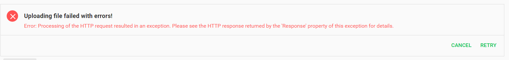

# Pip.WebUI.Files User's Guide

## <a name="contents"></a> Contents
- [Installing](#install)
- [pipFileUpload](#file_upload)
- [pipFileProgress](#file_progress)
- [pipFileUploadService](#file_upload_service)
- [Questions and bugs](#issues)


## <a name="install"></a> Installing

Add dependency to **pip-webui** into your **bower.json** or **package.json** file depending what you use.
```javascript
"dependencies": {
  ...
  "pip-webui": "*"
  ...
}
```

Alternatively you can install **pip-webui** manually using **bower**:
```bash
bower install pip-webui
```

or install it using **npm**:
```bash
npm install pip-webui
```

Include **pip-webui** files into your web application.
```html
<link rel="stylesheet" href=".../pip-webui-lib.min.css"/>
<link rel="stylesheet" href=".../pip-webui.min.css"/>
...
<script src=".../pip-webui-lib.min.js"></script>
<script src=".../pip-webui.min.js"></script>
```

Register **pipFiles** module in angular module dependencies.
```javascript
angular.module('myApp',[..., 'pipFiles']);
```

## <a name="file_upload"></a> pipFileUpload

**pipFileUpload** control allows to select file before loading this file in server.

### Usage
```html
     <pip-file-upload local-file="localFile"></pip-file-upload>
```


### Arguments
* **local-file** - file

## <a name="file_progress"></a> pipFileProgress

**pipFileProgress** control for different states of progress

### Usage
```html
  <pip-file-progress  
             pip-cancel="cancel" 
             pip-retry="onOk" 
             pip-name="localFile.name"> </pip-file-progress>
```




### Arguments
* **pip-cancel** - function for cancel button
* **pip-retry** - function for retry button 
* **pip-name** - name file (argument with type string)

## <a name="file_upload_service"></a> File upload service

**pipFileUpload** service for uploading files and managing progress.

### Usage
```javascript
  thisModule.controller('UploadController',
         function ($scope,..., pipFileUpload) {
 
             $scope.onOk = () => {
 
                 pipFileUpload.upload(
                     "...", // server url 
                     $scope.localFile, // some file
                     (data, err) => {
                         if (data) {
                             // success 
                         } else {
                            // error
                         }
                     }
                 );
             }
 
             $scope.onGlobalProgress = () => {
                 return pipFileUpload.globalProgress;
             }
             
         });
```

### Arguments
* **globalProgress** - the line is equivalent to one state of 'start', 'upload', 'fail'
* **progress** - number of progress 
* **error** - error string
* **transaction** - pip.services.Transaction

### Methods
* **upload(url: string, file: any, callback?: (data: any, err: any) => void): void** - upload file
* **abort(): void** - abort transaction and change progress in null value


### Interface 

**pipFileUpload** service implements **IFileUploadService**

### Classes 

if you need you can export **GlobalProgress** class with options for *globalProgress*

```javascript
    export class GlobalProgress {
        public static All: string[] = ['start', 'upload', 'fail'];
        public static Start: string = 'start';
        public static Upload: string = 'upload';
        public static Fail: string = 'fail';
    }
```


## <a name="issues"></a> Questions and bugs

If you have any questions regarding the module, you can ask them using our 
[discussion forum](https://groups.google.com/forum/#!forum/pip-webui).

Bugs related to this module can be reported using [github issues](https://github.com/pip-webui/pip-webui-dialogs/issues).
